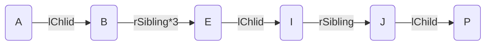

:::info
该系列为本人的学习笔记，主要由本人整理书写而成。部分内容来自教材、视频课程等，不能保证完全原创性。
:::

萌新的学习笔记，写错了恳请斧正。

#### 树

树是一种**非线性的数据结构**，它是由 n 个节点组成的一个具有层次关系的数据集合。其大概结构如下图：


其形状类似于一棵倒挂的树，由此得名。

##### 树的相关概念

+ 节点：树中每一个存储数据的元被称为节点。上方示意图中A~Q都是这棵树的节点。
+ 根节点：**根节点没有父节点**，是整棵树的最上面的节点，是该树其他所有节点的发源。也就是上面示意图中的A节点。
+ 父节点（双亲节点）：就是树中与某节点相连但在其“上方”的节点。比方说，上方示意图中A是BCDEFG的父节点、E是IJ的父节点。
+ 子节点（孩子节点）：与父节点相对，就是树中与某节点相连但在其“下方”的节点。比方说，上方示意图中BCDEFG都是A的子节点。
+ 兄弟节点：有相同父节点的节点互为兄弟节点。比方说，上方示意图中B与C互为兄弟节点、P与Q互为兄弟节点。
+ 堂兄弟节点：只要两个节点互不为兄弟节点但处于树的**同一层**（与根节点的距离相同，则称其为堂兄弟节点。比方说，上方示意图中H与J互为堂兄弟节点。
+ 节点的祖先：一个节点到根节点的**唯一路径**上所有的节点都是该节点的祖先。比方说，上方示意图中A节点为所有节点的祖先。
+ 节点的子孙：又某一个节点“向下”延伸出来的所有节点都是该节点的子孙。比方说，上方示意图中其他所有节点都是A节点的子孙。
+ 子树：把**根节点的一个子节点**拿出来，这个节点与其所有子孙再次组成一棵树，这棵树就称为母树（原本的树）的一棵子树。比方说上方示意图中E、I、J、P、Q就构成了母树的一棵子树。==注意子树可以只有一个根节点==
+ 节点的度：一个节点的子树的个数称为节点的度。比方说，上方示意图中A节点的度为6
+ 树的度：一棵树最大的节点的度就是这棵树的度。比方说，上方示意图中树的度就是A节点的度，为6.
+ 叶节点（终端节点）：度为0的节点（没有子节点）就是叶节点。比方说，上方示意图中BCHIKLMNPQ都是叶节点。
+ 分支节点（非终端节点）：度不为0的节点（有子节点）就是分支节点。比方说，上方示意图中ADEFGJ都是分支节点。
+ 森林：多颗不相连的树组成森林。

##### 树的表示

树的表示方法有多种，这里介绍较为常用的**左孩子右兄弟表示法**。这个方法能够让我们方便的向下查找。

我们定义一个结构体作为树的节点：

```c
typedef int TDataType	//树存储的数据类型

typedef struct Tree
{
	TDataType data;
    struct Tree* lChild;
    struct Tree* rSibling;
} Tree;
```

这个结构体中，**lChild存储该节点最左边的子节点，rSibling存储与其紧邻的右侧兄弟节点**。

这样，我们还是以上方示意图为例，为了方便我再次把图片贴出：


如果我们想通过A节点找到P节点，这时问题就会变的非常简单了，只需要按照如下路线图寻找即可：



**如果想要子节点也能向上寻找，那还可以再结构体中添加一个成员用于储存父节点。**

#### 二叉树基础

二叉树是一种特殊的树结构，其特征为**每一个节点都==有且只有==两个子树或空子树**。

下方是一个二叉树的示意图（其中2节点的右子树就是空）：


我们还可以更加抽象一点，下图同样也是一个二叉树：


##### 二叉树分类

有两种特殊的二叉树类型需要我们单独的来看一看，它们是**满二叉树**和**完全二叉树**。

###### 满二叉树

一个二叉树如果每一层的节点数都达到最大，那这就是一个满二叉树，一个 k 层的满二叉树的节点总数是 2^k^ - 1 。


###### 完全二叉树

完全二叉树的概念看图很好理解，但是用文字描述就比较复杂了。++对于深度为 K 的有 n 个节点的二叉树，当且仅当其每一个节点都与深度为 K 的满二叉树中编号从 1 至 n 的节点一一对应时称之为完全二叉树++{.wavy}。


##### 二叉树的性质

1. 一棵非空二叉树的**第 i 层上最多有 2^i-1^ 个节点**。
2. 深度为 h 的二叉树的**最大节点数是 2^h^ - 1** 。
3. 对任何一棵二叉树，==若度为 0 的节点个数为 n~0~ ，度为 2 的节点个数为 n~2~ ，那么 n~0~ =  n~2~ + 1== 。
4. 具有 n 个节点的**满二叉树深度为 log~2~(n + 1)** 。
5. 若逐层从左至右给每一个节点编号（**根节点编号0**），那么对应序号为 i 的节点：
   1. **i 的父节点的编号为 $\lfloor (i-1)/2 \rfloor$ （当$i>0$时）**
   2. **i 的左孩子节点编号为 $2i+1$（当$2i+1<n$时）**
   3. **i 的右孩子节点编号为 $2i+2$（当$2i+2<n$时）**

##### 二叉树的存储结构

实现二叉树我们一般有两种存储结构，一种是**顺序存储**，一种是**链式存储**。

###### 顺序存储

顺序存储就是用顺序表（数组）来存储节点，**一般来说只适用于完全二叉树**。

因为对于完全二叉树，我们可以逐层从左至右给节点编号，存储在数组对应位置，再通过二叉树的性质轻易找到其父节点或左右孩子节点。


如果不是完全二叉树，这样中间就会有大量的空节点，造成空间浪费。

对于这种存储方式，将在下一篇笔记通过堆（一种基于二叉树的数据结构）来实现与细致的讲解。

###### 链式存储

链式存储就是用链表来存储二叉树的节点。一般来说有两种实现，分别是二叉链和三叉链。

二叉链就是链表的每个节点由数据域和左右指针域组成，左右指针分别指向左孩子与右孩子节点。对于一些更复杂的数据结构，我们可能会使用到基于三叉链的二叉树，也就是再增加一个指针指向其父节点。

```c
//Binary Tree 二叉树
typedef int BTDataType;
    
//二叉链
typedef struct BTNode
{
    struct BTNode* lChild;
    struct BTNode* rChild;
    BTDataType data;
} BTNode;

//三叉链
typedef struct BTNode
{
    struct BTNode* lChild;
    struct BTNode* rChild;
    struct BTNode* parent;
    BTDataType data;
} BTNode;
```


