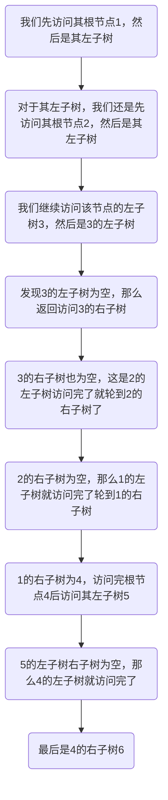

:::info
该系列为本人的学习笔记，主要由本人整理书写而成。部分内容来自教材、视频课程等，不能保证完全原创性。
:::

萌新的学习笔记，写错了恳请斧正。

#### 链式二叉树

这篇笔记我们讨论基于**链式二叉树**，其节点的数据结构如下：

```c
typedef int BTDatatype;

typedef struct BTNode
{
    BTDataType data;
    struct BTNode* left;
    struct BTNode* right;
} BTNode;
```

#### 二叉树的遍历

先了解关于二叉树的遍历再去了解二叉树的创建会更轻松一点。

二叉树的遍历基本分两类，一类是**深度优先**的，另一类是**广度优先**的。

**对于深度优先的遍历，又分为前序遍历、中序遍历、后序遍历；对于广度优先的遍历，只有层序遍历。** 

##### 前序遍历（PreOrder Traversal）

从根节点开始，对于==每一个子树==，先访问其根节点，再访问其左子树和右子树。

比方说，对于下面这个二叉树：




所以最终节点的访问顺序为：

**1-->2-->3-->N-->N-->N-->4-->5-->N-->N-->6-->N-->N**

下面这张图可能更直观些：


下面给出其实现（==递归的思想==）：

```c 前序遍历
void BinaryTreePrevOrder(BTNode* root)
{
	if (root == NULL)
	{
		return;
	}
	printf("%c ", root->data);
	BinaryTreePrevOrder(root->left);
	BinaryTreePrevOrder(root->right);
}
```

##### 中序遍历（InOrder Traversal）

中序遍历对每一个子树则是先访问其左子树，随后是根节点和右子树。

对于上方的示例，如果用中序遍历，顺序就会变为：

**N-->3-->N-->2-->N-->1-->N-->5-->N-->4-->N-->6-->N**

下面给出其实现：

```c 中序遍历
void BinaryTreeInOrder(BTNode* root)
{
	if (root == NULL)
	{
		return;
	}
	BinaryTreeInOrder(root->left);
	printf("%c ", root->data);
	BinaryTreeInOrder(root->right);
}
```

##### 后序遍历（PostOrder Traversal）

同理，后序遍历就是最后访问根节点，对于上例的顺序为：

**N-->N-->3-->N-->2-->N-->N-->5-->N-->N-->6-->4-->1**

下面给出其实现：

```c 后序遍历
void BinaryTreeInOrder(BTNode* root)
{
	if (root == NULL)
	{
		return;
	}
	BinaryTreeInOrder(root->left);
	BinaryTreeInOrder(root->right);
	printf("%c ", root->data);
}
```

##### 层序遍历（LevelOrder Traversal）

层序遍历就是**逐层的一个一个元素遍历，与前几个一条路走到底再拐回来的遍历方式不同**。

想要实现二叉树的层序遍历，就不仅仅是递归这么简单了，我们需要借助之前学的数据结构：==队列==。

层序遍历的步骤：

1. **初始化队列：** 首先，将根节点放入队列中。
2. **遍历队列：** 当队列不为空时，重复以下步骤：
   + 从队列中取出一个元素（节点）。
   + 访问这个节点。
   + 如果这个节点有左子节点，则将左子节点放入队列。
   + 如果这个节点有右子节点，则将右子节点放入队列。

通过这种方式，可以保证每个节点都按照层序被访问一次，同时每个节点只会被放入队列一次，从而实现二叉树的层序遍历。

对于这个方法的理解，ChatGPT给出了一个比较生动的例子：

> 想象一下，你在组织一场大型的派对游戏，游戏的目标是确保每个人都能按顺序获得一个气球。派对的参与者按照到达的顺序站成一列，每个人都可能带着一两个朋友。在这个比喻中，每个参与者就像是树中的一个节点，他们带来的朋友分别对应于这个节点的左右子节点。
>
> 1. **开始游戏：** 游戏开始时，你手里只有一个气球，而第一个参与者（对应于树的根节点）站在你面前。你将这个气球给了他，并询问是否有朋友一起来。他回答说带了两个朋友（左右子节点）。
> 2. **组织队列：** 为了管理游戏的顺序，你拿出一个大篮子（对应于队列），让第一个参与者的朋友们按照他们被介绍的顺序站到篮子后面。现在，篮子里有两个人在等待气球。
> 3. **进行派对游戏：** 接下来，你从篮子（队列）的前端取出一个人（节点），给他一个气球，并询问他是否也有带朋友来。如果有，他的朋友们也按顺序加入到篮子的末尾。
> 4. **重复步骤：** 按照这个流程，你一直重复，总是从篮子的前端取人，给他气球，然后将他的朋友们（如果有的话）加入到篮子的末尾。
>
> 通过这个过程，每个参与者都会按照他们到达派对的顺序获得气球。同样地，在二叉树的层序遍历中，我们利用队列这一数据结构，确保了每个节点都能按照它们在树中的层级顺序被访问。就像在游戏中一样，通过不断地将朋友（子节点）加入队列并按顺序访问，我们能够遍历树中的每一个节点，从而实现层序遍历。

下面给出其实现：

```c 层序遍历
void BinaryTreeLevelOrder(BTNode* root)
{
	Queue q;
	QueueInit(&q);
	if (root != NULL)
	{
		QueuePush(&q, root);
	}
	while (!QueueEmpty(&q))
	{
		BTNode* front = QueueFront(&q);
		QueuePop(&q);

		if (front->_left != NULL)
		{
			printf("%c ", front->_data);
			QueuePush(&q, front->_left);
			QueuePush(&q, front->_right);
		}
		else
		{
			printf("NULL ");
		}
	}
	printf("\n");

	QueueDestory(&q);
}
```

#### 二叉树的创建与销毁

我们以一道题为例：

> 编一个程序，读入用户输入的一串先序遍历字符串，根据此字符串建立一个二叉树（以指针方式存储）。 例如如下的先序遍历字符串： ABC##DE#G##F### 其中“#”表示的是空格，空格字符代表空树。建立起此二叉树以后，再对二叉树进行中序遍历，输出遍历结果。

有了前面的内容这里就很好完成了，实现如下：

```c
BTNode* BuyBTNode(BTDataType x)
{
	BTNode* new = (BTNode*)malloc(sizeof(BTNode));
	if (new == NULL)
	{
		perror("malloc");
		exit(EXIT_FAILURE);
	}
	new->_data = x;
	new->_left = NULL;
	new->_right = NULL;
	return new;
}

BTNode* BinaryTreeCreate(BTDataType* a, int n, int* pi)
{
	if (*pi >= n || a[*pi] == '#') 
	{
		(*pi)++; // 跳过当前的'#'或越界的元素
		return NULL;
	}
	BTNode* root = BuyBTNode(a[(*pi)++]);
	root->_left = BinaryTreeCreate(a, n, pi);
	root->_right = BinaryTreeCreate(a, n, pi);
	return root;
}
```

而二叉树的销毁就更加简单了：

```c
void BinaryTreeDestroy(BTNode** root)
{
	if (*root == NULL)
	{
		return;
	}
	BinaryTreeDestroy(&(*root)->_left);
	BinaryTreeDestroy(&(*root)->_right);
	free(*root);
	*root = NULL;
}
```

#### 其他二叉树相关

```c
// 二叉树节点个数
int BinaryTreeSize(BTNode* root)
{
	if (root == NULL)
	{
		return 0;
	}
	return 1 + BinaryTreeSize(root->_left) + BinaryTreeSize(root->_right);
}
// 二叉树叶子节点个数
int BinaryTreeLeafSize(BTNode* root)
{
	if (root == NULL)
	{
		return 0;
	}
	if (root->_left == NULL && root->_right == NULL)
	{
		return 1;
	}
	return BinaryTreeLeafSize(root->_left) + BinaryTreeLeafSize(root->_right);
}
// 二叉树第k层节点个数
int BinaryTreeLevelKSize(BTNode* root, int k)
{
	if (root == NULL)
	{
		return 0;
	}
	if (k == 1)
	{
		return 1;
	}
	return BinaryTreeLevelKSize(root->_left, k - 1) + BinaryTreeLevelKSize(root->_right, k - 1);
}
// 二叉树查找值为x的节点
BTNode* BinaryTreeFind(BTNode* root, BTDataType x)
{
	if (root == NULL)
	{
		return NULL;
	}
	if (root->_data == x)
	{
		return root;
	}
	BTNode* ret = BinaryTreeFind(root->_left, x);
	if (ret != NULL)
	{
		return ret;
	}
	return BinaryTreeFind(root->_right, x);
}
// 判断二叉树是否是完全二叉树
int BinaryTreeComplete(BTNode* root)
{
		Queue q;
	QueueInit(&q);
	if (root != NULL)
	{
		QueuePush(&q, root);
	}
	while (!QueueEmpty(&q))
	{
		BTNode* front = QueueFront(&q);
		QueuePop(&q);
		if (front == NULL)
		{
			break;
		}
		QueuePush(&q, front->_left);
		QueuePush(&q, front->_right);
	}
	while (!QueueEmpty(&q))
	{
		BTNode* front = QueueFront(&q);
		QueuePop(&q);
		if (front != NULL)
		{
			QueueDestroy(&q);
			return 0;
		}
	}
	QueueDestroy(&q);
	return 1;
}
```

